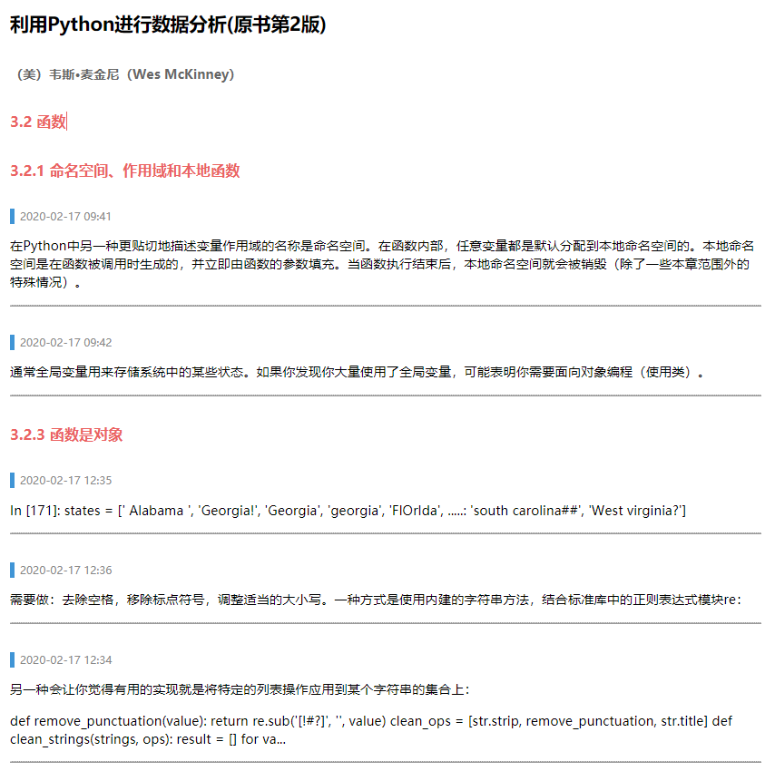
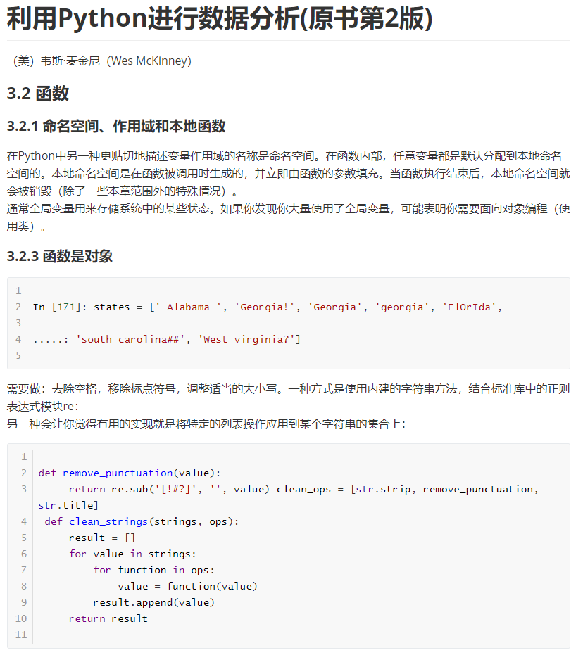

# 读书笔记自动清理脚本合集

## 楔子

我在当当云阅读充值了10年会员，书城里我感兴趣且可以免费阅读的书倒是挺多的，这辈子肯定看不完了。但是当当云阅读App相比多看阅读、微信读书有个很大的弊端——笔记导出功能受限：

1. 笔记划线不能超出两页，大段内容只能分页标注；
2. 导出的笔记不完整，单条笔记内容超过230个字符就会被直接截断，用...代替（英文、数字字符也计算在内，因此大多数代码段落都会超出）；
3. 笔记导出后格式全乱了，特别是代码段落的间隔、空行都消失了，全部挤在一起没法看。

为解决上述问题，写了一些自用的阅读App导出笔记自动清理脚本。后来又陆续添加了一些Markdown文件、Jupyter笔记本ipynb文件、大纲笔记opml文件的一些转换脚本，可以方便的将清理完成的Markdown笔记导入到幕布、Workflowy等大纲笔记软件。

## 主要功能

### 1. 自动补全、清理、格式化当当云阅读等App导出的读书笔记，生成Markdown文件

- **readnotes2markdown.py:** 当当云阅读App导出笔记整理成Markdown文档
  1. 在当当云阅读App中将读书笔记导出到印象笔记，从印象笔记中拷贝文本到'draftnotes.txt'文本文件；
  2. 找到其中不完整笔记(...结尾部分)，在App中复制到剪贴板（建议在手机后台运行一个“剪纸堆”等剪贴板管理软件，自动保存所有复制内容）；
  3. 将所有复制内容导出到'fullnotes.txt'文本文件；
  4. 运行此脚本，将自动匹配和补全笔记、去除时间标记、增加标题行Markdown标记、清理代码格式；
  5. 在此目录下自动生成一个以首行内容为名的Markdown文件，即为清理后的笔记，你可以再把它复制到印象笔记/为知笔记等云笔记软件保存。

| 导出的原始笔记（印象笔记）                                   | 自动整理后的笔记（注意最后一条笔记被补全了，并整理了代码格式） |
| ------------------------------------------------------------ | ------------------------------------------------------------ |
|  |  |

**其他辅助脚本：**

- **pasted_code_cleaner.py:** 每隔2秒自动整理剪贴的python代码，并保存到系统剪贴板
- **remove_noncode_empty_lines.py:** 删除文本文件中非代码区域的所有空行
- **extract_descriptions.py:** 提取指定目录下python脚本描述内容，生成脚本概览(markdown文件)

### 2. Markdown笔记转换为opml文件，可以直接粘贴到Workflowy、幕布等大纲笔记软件

- **markdown2opml.py:** Markdown文档批量转为workflowy、幕布等导图软件支持的opml文件（带层次结构）; Markdown文件须以标题行开头（# XX）; 所有标题行作为清单项，非标题行作为备注

  | Markdown笔记                                                 | Workflowy笔记                                                |
  | ------------------------------------------------------------ | ------------------------------------------------------------ |
  |  |  |

  

- **markdown_clipboard_2opml.py:** 拷贝到剪贴板的Markdown文档内容转为workflowy支持的opml文件内容（带层次结构）; 所有标题行（#...）作为清单项，非标题行作为备注

- **mubu2workflowy_opml.py:** 把幕布软件导出的opml文件转换成可在workflowy直接粘贴的格式

### 3. Markdown文件转换为ipynb文件，可以用Jupyter打开后互动式编辑、运行其中代码段落

- **markdown2ipynb.py:** Markdown文档转为Jupyter的ipynb文件

  | Markdown笔记                                                 | Jupyter Notebook笔记                                         |
  | ------------------------------------------------------------ | ------------------------------------------------------------ |
  |  |  |

  

